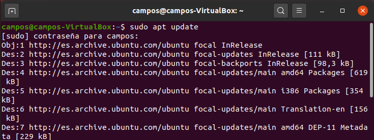
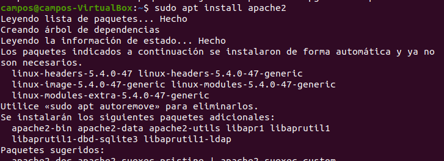
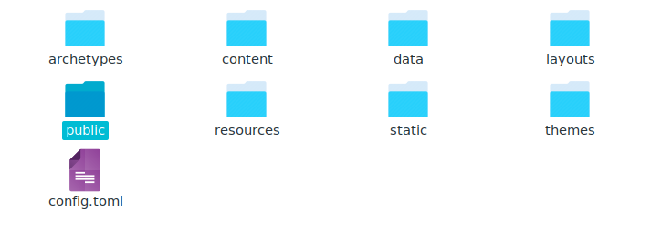

Adrián Campos Morató
# Apache 
**1.- Instalación**

    -El primer paso que debemos hacer es realizar un update a la máquina. 

    -Una vez terminado, instalaremos Apache con el comando "sudo apt install apache.

**2.- Configuración Apache (/var/www/html)**

    -Una vez instalado Apache, cambiamos el grupo propietario de la carpeta "html" a www-data con el siguiente comando:
    sudo chgrp www-data /var/ww/html

    -Ahora añadimos nuestro usuario a estre grupo con el siguiente comando:
    sudo usermod -a -G www-data (eljust)

    -Seguidamente daremos permisos de manera recursiva a todos los archivos dentro de la carpeta:
    sudo chmod -R 775 /var/www/html
    sudo chmod -R 775 /var/www/html

    -Por último, añadimos a nuestro usuario como propietario para trabajar directamente:
    sudo chown -R eljust /var/www/html

**3.- Comandos para Apache**

Algunos comandos básicos de Apache son:
    
    Para ver el estado de Apache:
    sudo systemctl status apache2

    Para parar el servicio de Apache:
    sudo systemctl stop apache2

    Para reiniciar el servicio de Apache:
    sudo systemctl restart apache2

    Para iniciar el servicio de Apache:
    sudo systemctl start apache2

**4.- Hugo**

    -El primer paso en hugo es crear nuestro sitio web, con el comando hugo new site (nombre)

    -Una vez creado y decorado a nuestra manera, dentro del sitio web creado, usaremos el comando "hugo server -D" para empezar a ver nuestro sitio en el Apache.

    -Cuando ya este hecho completamente, nos vamos a la carpeta de nuestro sitio web y realizaremos el comando Hugo para que nos cree nuestro servidor y lo pase a html.

    -Cuando este la carpeta public creada, usaremos el siguiente comando para copiar la carpeta public a la carpeta de Apache de esta manera se mostrara como un sitio web.
    cp -r Public/ /var/www/html

    -Por ultimo entramos a nuestro Apache y veremos la salida.

