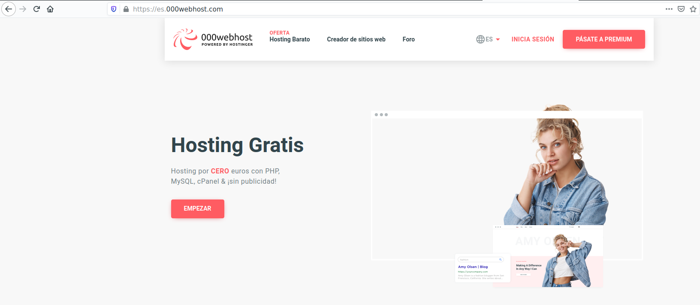
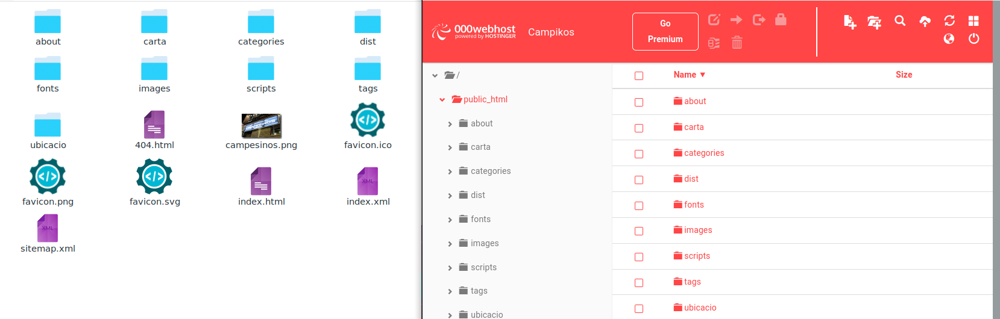
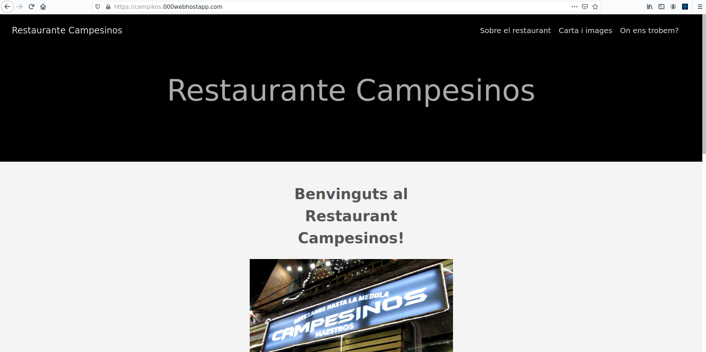

**1.- Host Web Gratuito**

    -Entramos a la página https://es.000webhost.com/ y nos creamos una sesión.

    -Una vez creada, le damos a siguiente a todo hasta que nos pida subir archivos, pues en public_html subiremos nuestros archivos de la carpeta public.

    -Cuando este todo lo que queremos subido, volvemos a la página principal y nos saldra ahi nuestro sitio web creado.

