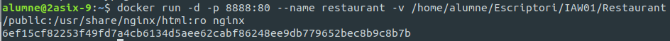
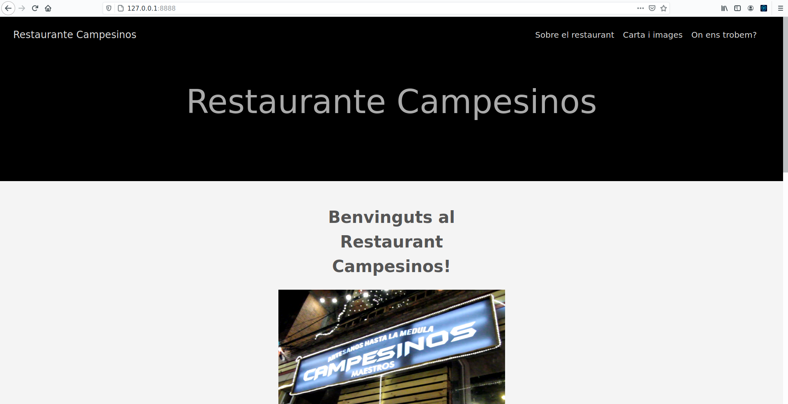
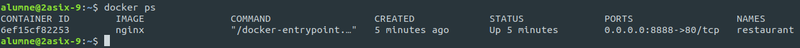
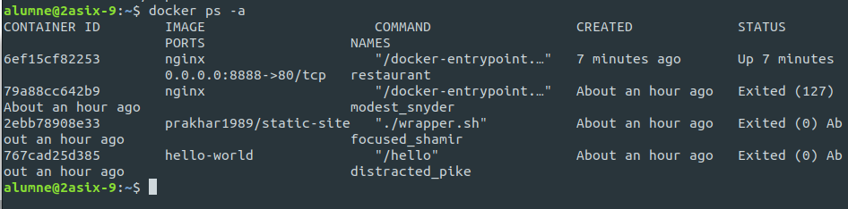

Adrián Campos Morató
# Docker

**1.- Creacio contenidor.**
    
    -Primer crearem el contenidor amb el següent comandament i li fiquem el nom que elegim.

**2.- Llançament**

    -Per a llançar el nostre servidor podem usar el següent comandament que es bàsic.
    "docker run -d -p 8888:80 ngin nginx_prova nginx

**3.- Public**

    -Per últim, esta linea fara que use la imatge de nginx per a crear el contenidor i gastar la carpeta com el seu DocumentRoot i nosaltres afegirem la carpeta Public.

**4.- Vista**

    -Per a vore el resultat, disponem de l'adreça '127.0.0.1:8888' en el que esta la web funcionant en Docker.

**5.- Ordres basiques**

    -Per tal de veure els contenidors disposem de la ordre 'docker ps'.

    -Amb 'docker ps -a' podem veure les sessions creades amb el usuario actual.

